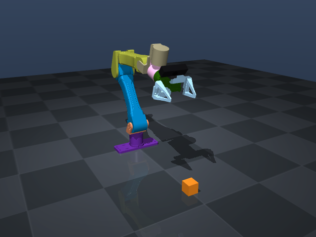
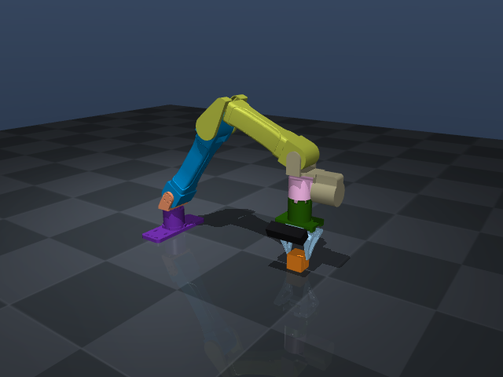
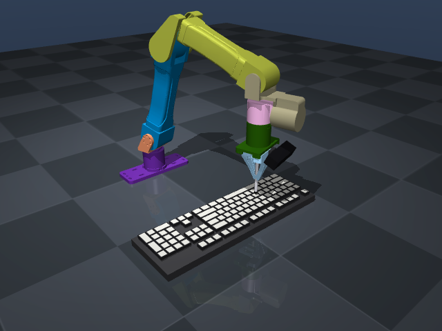
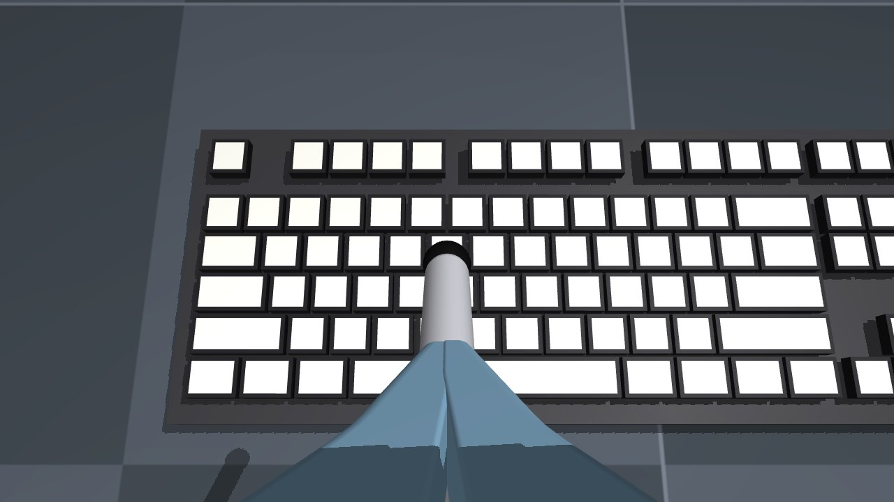
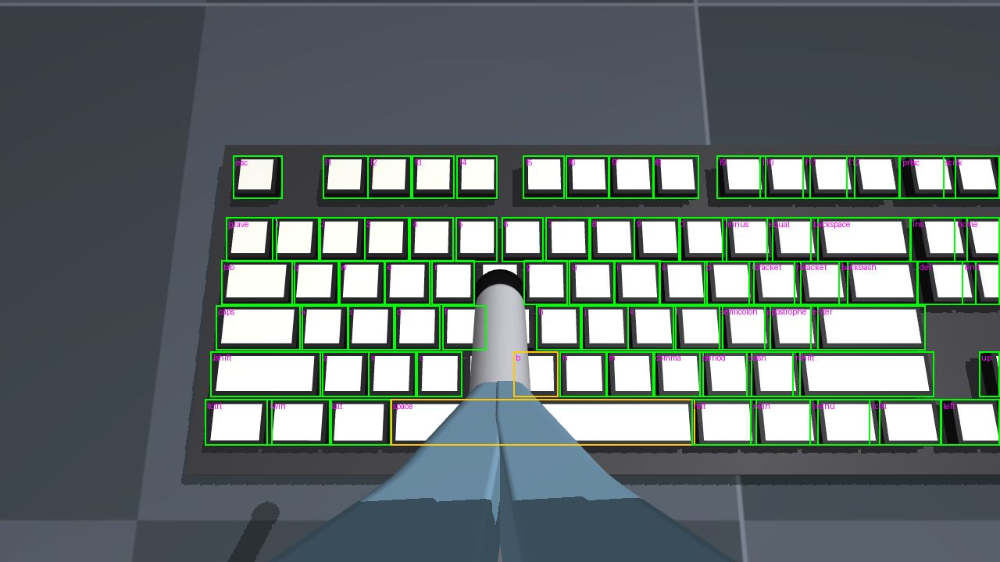

# YAM arm simulator (`arm_sim/`)

This is a MuJoCo physics simulation of the I2RT **YAM** 6-DoF arm, the arm the HURC rover team owns.
It exposes the same control API as the `Robot` that I2RT's
[`i2rt`](https://github.com/i2rt-robotics/i2rt) driver returns from `get_yam_robot(...)`. You can
write and test arm code on a Mac, then run **the same script** on the real arm by adding
`--channel can0`.

| Ready pose | Grasping the test cube |
| --- | --- |
|  |  |

Unlike i2rt's own `SimRobot`, which mostly teleports the joints, this is a dynamic simulation. Each
motor is modelled as a Damiao MIT-mode PD controller with torque limits, gravity compensation, joint
friction, rotor inertia, the 400 ms CAN watchdog, and i2rt's gripper force limiter.

## Setup

You need [pixi](https://pixi.sh) (`~/.pixi/bin/pixi`). Everything comes from conda-forge, plus this
package installed in editable mode. Supported platforms are `osx-arm64` and `linux-64`, with Python 3.11.

```bash
cd arm_sim
pixi install          # one time
pixi run test         # headless test suite
pixi run sim          # interactive 3-D viewer
```

**macOS needs `mjpython`.** MuJoCo's interactive (passive) viewer has to own the Cocoa main thread,
so on macOS it only works under the `mjpython` launcher, which ships with the conda-forge `mujoco`
package. `pixi run sim` already uses `mjpython`. If you start the viewer with plain `python`, it
relaunches itself under `mjpython`. Headless use doesn't need `mjpython`: the API, tests,
`mujoco.Renderer` and the other scripts all run under plain `python`. On Linux, plain `python` works
for everything.

## Tasks

| Command | What it does |
| --- | --- |
| `pixi run sim [--gripper crank_4310] [--objects [cube\|keyboard]] [--tool stylus] [--control]` | Interactive viewer (see controls below) |
| `pixi run teleop` | Terminal keyboard teleop with no GUI (needs a real terminal) |
| `pixi run go-to --joints 0 1 1 -0.3 0 0 --grip 1` | Smooth move to a joint vector (`--deg` for degrees) |
| `pixi run go-to --pos 0.35 0 0.25 [--rpy 0 1.57 0]` | Smooth move to a `grasp_site` pose using IK |
| `pixi run play demo traj.csv` / `pixi run play replay traj.csv --speed 0.5` | Write a demo trajectory / replay a CSV or JSON trajectory |
| `pixi run play record traj.csv --duration 10 --zero-gravity` | Record joint positions (on hardware, move the arm by hand) |
| `pixi run sliders` | Tkinter slider panel (joints in degrees, gripper 0–1, Home/Ready/Open/Close/Float) |
| `pixi run smoke` | Headless tracking test. Prints per-joint RMS/max error and peak torque. Exits 1 on failure |
| `pixi run render [--keyboard]` | Offscreen renders of a few poses into `docs/img/` (`--keyboard`: also the keyboard/wrist-camera images) |
| `pixi run press -- "hello world"` | Type a string on the simulated keyboard with a stylus (see [Wrist camera and keyboard](#wrist-camera-and-keyboard)) |
| `pixi run dataset -- --n 200 --out data/keys` | Labelled wrist-camera dataset of keyboard keys (YOLO + COCO) |
| `pixi run -e train train -- --data data/keys/data.yaml` | Train a YOLO key detector (optional `train` environment) |
| `pixi run -e train detect -- --weights best.pt --sim` | Run the detector on sim frames or a real webcam (`--webcam 0`) |
| `pixi run test` | pytest suite |

Every script takes `--sim` (the default) or `--channel can0` (real arm), plus `--arm`,
`--gripper linear_4310|crank_4310|no_gripper`, `--zero-gravity`, and the sim-only scene options
`--objects` (alone: a 4 cm cube; `--objects keyboard`, `--objects cube,keyboard`), `--camera c920|c270|none`
(wrist webcam, default `c920`) and `--tool stylus`.

## Viewer controls (`pixi run sim`)

Modes work like i2rt's `control_with_mujoco`. **SPACE** toggles between them:

* **VIS** (the start mode): gravity-comp idle (kp = 0). The arm floats and the green marker follows
  the end effector. In the sim you can push the arm by double-clicking a link and then
  ctrl + right-dragging (forwarding these forces is implemented but has not been tested by hand).
* **CONTROL**: the arm PD-tracks a target and the marker turns red. Double-click the marker, then
  **ctrl + right-drag** to translate it or **ctrl + left-drag** to rotate it. IK follows the marker.

| Key | Action |
| --- | --- |
| `SPACE` | VIS ↔ CONTROL |
| `1`–`6` / `7` | select joint / gripper |
| `=` / `-` (keypad `+`/`-`) | jog the selected joint (gripper ±0.1) |
| ↑ / ↓, ← / →, PgUp / PgDn | nudge the end effector ±x, ±y, ±z (base frame) |
| `End` | toggle the gripper open/closed |
| `Home` | glide to home (all zeros) |
| `;` / `'` | halve / double the jog and nudge step |
| `Backspace` | reset the simulation (sim only) |
| `C` | toggle the view between the free camera and the wrist webcam (MuJoCo also toggles its contact-point display on `C`; `[`/`]` cycle model cameras too) |

On a Mac keyboard, PgUp/PgDn are fn+↑/↓ and Home/End are fn+←/→. Most letter keys are already
MuJoCo's own visualisation toggles, so the bindings above avoid them. The overlay shows the mode, q,
q_des and torque for each joint, the end-effector position, the camera model and view, the keys
currently held down and the text typed so far (with `--objects keyboard`), and a help box. Every viewer motion is
rate-limited (`--max-speed`, default 1 rad/s).

Terminal teleop (`pixi run teleop`): `1`–`7` select, `+`/`-` jog, `w/s a/d r/f` move the end
effector in x/y/z, `o/c/g` open/close/toggle the gripper, `h`/`y` go home/ready, `space` toggles
HOLD↔FLOAT, `[`/`]` change the step, `p` prints the observation, and `q` quits.

## Python API

It mirrors the snippet in i2rt's README:

```python
import numpy as np
from yam_sim import make_robot

robot = make_robot("sim", arm="yam", gripper="linear_4310")   # sim on any machine
# robot = make_robot("real", channel="can0")                  # real arm: calls i2rt get_yam_robot()

q = robot.get_joint_pos()          # shape (7,): 6 joints [rad] + gripper [0 = closed, 1 = open]
robot.command_joint_pos(np.array([0, 1.0, 1.0, -0.3, 0, 0, 1.0]))
obs = robot.get_observations()     # joint_pos/vel/eff (6,), gripper_pos/vel/eff (1,)
robot.close()
```

On the real host you can also skip `yam_sim` and call i2rt directly. The calls after construction are the same:

```python
from i2rt.robots.get_robot import get_yam_robot
from i2rt.robots.utils import ArmType, GripperType
robot = get_yam_robot(channel="can0", arm_type=ArmType.YAM, gripper_type=GripperType.LINEAR_4310)
```

`YamSimRobot` implements the i2rt `Robot` protocol (duck-typed, with no `i2rt`/`dm_env` import):
`num_dofs`, `get_joint_pos`, `get_joint_state`, `command_joint_pos`, `command_joint_state`
(`pos`, `vel`, optional `kp`/`kd`), `command_target_vel`, `get_observations`, `get_robot_info`,
`reinit`, `close`. It also has the extra public `MotorChainRobot` methods: `get_motor_torques`,
`zero_torque_mode`, `update_kp_kd`, `enter_gravity_comp_idle`, `move_joints`, `xml_path`.

It follows the same conventions as hardware:

* `zero_gravity_mode=True` (the default) means gravity comp plus a small damping, with no
  position hold. The first `command_joint_pos` turns on PD holding.
* Arm commands are clipped to the MJCF range ±0.15 rad, and the gripper is clipped to [0, 1].
* The observation keys match i2rt's `SimRobot`/`MotorChainRobot`.

There are also sim-only helpers:

* Synchronous, deterministic stepping: `YamSimRobot(start_thread=False)` with `step(n)` and `step_for(seconds)`.
* `reset(q, hold=)`, `stall_bus(seconds)`, `get_applied_torques()`, `get_ee_pose(site)`,
  `get_commanded_pos()`, `set_external_forces()`, `watchdog_tripped`, `model`, `data`, `lock`.

`yam_sim.kinematics.Kinematics` provides `fk(q, frame)` for any site or body, a 6×6
`jacobian(q, frame)`, and `ik(T or xyz, frame, init_q)`. The IK is damped least squares with
joint-limit clamping and random restarts. It needs no `mink`.
`yam_sim.assembly.build_scene(arm, gripper)` returns the full scene MJCF, and `build_scene_file`
writes it to a path.

## Wrist camera and keyboard

The team's goal is a key detector that runs on a Logitech webcam clamped near the end effector,
and eventually an arm that presses keys. The sim has the matching pieces: the wrist camera, a
pressable keyboard, a stylus, a key-pressing demo, a labelled dataset generator, and YOLO
training/inference hooks.

| Keyboard and stylus | Wrist camera (C920, 1280x720) | Dataset labels |
| --- | --- | --- |
|  |  |  |

### Wrist webcam (`yam_sim/camera.py`, `yam_sim/models/camera/*.yml`)

Every scene gets a webcam on the gripper unless you pass `camera="none"` (CLI `--camera none`).
Each model has one YAML file, `yam_sim/models/camera/logitech_c920.yml` / `logitech_c270.yml`. It
holds the mount pose, FOV, resolutions, intrinsics, mass and size, and the ROS package can read the
same file.

| | Logitech C920 (default) | Logitech C270 |
| --- | --- | --- |
| Resolution (sim default) | 1280x720 (also 1920x1080, 640x360) | 1280x720 (also 640x360) |
| FOV diagonal / H / V | 78 / 70.4 / 43.3 deg | 55 / 48.8 / 28.6 deg |
| fx = fy at 1280x720 | 906.8 px | 1410.6 px |
| Mass added to the gripper | 0.162 kg | 0.075 kg |

**Mount.** The pose is the optical frame in the `gripper` mount body's frame. In that frame +Z is
the approach axis (towards the fingertips), +X is right and +Y is down; at home, gripper -Y is world
up. The camera sits on the gripper's top (-Y) face at `pos = (0, -0.052, 0.075)` m, with its lens
7 cm behind the fingertip ends and just in front of the housing's top plate. It is pitched 25 deg
towards the fingers (`quat_wxyz = (0.9763, -0.2164, 0, 0)`), so the optical axis crosses the
gripper axis 4.2 cm beyond `grasp_site`. `grasp_site` lands on the image's vertical centre line,
about 190 px below the centre at 720p, and the closed fingertips show as a small wedge at the
bottom of the frame. The camera head is a dark box (94x29x24 mm for the C920) with a cylinder lens
and a small bracket. It is visual only (no collision).

Frames: the body `wrist_camera` is the ROS optical frame (+Z forward, +X right, +Y down; site
`wrist_cam_optical`). The MuJoCo camera `wrist_cam` is the same frame turned 180 deg about X, as
MuJoCo cameras look down -Z. `fovy` is the vertical FOV, and `resolution` is the default size.
The offscreen buffer (`<visual><global offwidth="1920" offheight="1080">`) is large enough for
1080p.

```python
from yam_sim import YamSimRobot
from yam_sim.camera import WristCamera, RealWebcam, camera_spec

robot = YamSimRobot(objects="keyboard", camera="c920", tool="stylus")   # threaded is fine
cam = WristCamera(robot)                      # or WristCamera(model, data=data) without a robot
rgb = cam.render()                            # (720, 1280, 3) uint8
depth = cam.depth()                           # metres along the optical axis
seg = cam.segmentation("geom")                # geom id per pixel (-1 = background); "body" also works
uv = cam.project(points_world)                # (N, 2) pixels, OpenCV convention
cam.intrinsics(); cam.pose(); cam.camera_info()   # fx fy cx cy / optical->world 4x4 / ROS-style dict
camera_spec("c270").intrinsics(640, 360)
```

`WristCamera` copies the robot's state while holding `robot.lock` and renders into its own
`MjData`, so it doesn't stall the physics thread. Intrinsics follow the OpenCV/ROS convention:
fx = fy = (H/2)/tan(fovy/2) and cx = (W-1)/2. The sim is an ideal pinhole with zero distortion.

**Real webcam.** `RealWebcam(index=0, spec="c920")` has the same `render()` and returns RGB
through OpenCV. OpenCV is not in the default environment because the PyPI wheel took about 4.5
minutes to resolve and install here. Use `pixi run -e webcam ...` (OpenCV only) or the `train`
environment (which includes OpenCV):

```bash
pixi run -e webcam python -m yam_sim.camera --webcam 0 --out frame.png   # grab one frame
python -m yam_sim.camera --out wrist.png                                  # the same from the sim
```

On macOS, give your terminal camera access the first time
(System Settings > Privacy & Security > Camera). The real camera's nominal intrinsics come from
the same YAML. Calibrate the real camera (e.g. with an OpenCV checkerboard) for anything metric,
and turn off autofocus if you can.

**Hardware gravity compensation.** The webcam (and the stylus) add mass at the wrist. The sim's
gravity comp already includes it because it is in the model. i2rt's real driver doesn't know about
it unless you tell it. Print the override for your setup and pass it to `get_yam_robot`:

```bash
python -m yam_sim.camera --ee-mass                 # C920 + stylus -> ee_mass=0.729219, ee_inertia=[...]
python -m yam_sim.camera --ee-mass --tool none --camera c270
```

`get_yam_robot(..., ee_mass=..., ee_inertia=...)` overrides the gripper mount's inertial (0.553 kg
without the camera). These numbers combine the mount, the camera and the stylus into one inertial
in the mount frame.

### Keyboard (`yam_sim/keyboard.py`)

`objects="keyboard"` (CLI `--objects keyboard`) adds a procedurally built ANSI QWERTY keyboard.
`layout="full"` (the default) has 104 keys; `"tkl"` has 87 and no numpad. Keys sit on the 19.05 mm
pitch, and the wide keys use ANSI sizes: Backspace 2u, Tab 1.5u, Caps 1.75u, Enter 2.25u, Shift
2.25u/2.75u, Space 6.25u, 1.25u bottom-row modifiers, and numpad +/Enter/0 at 2u. The base is a
static body, so it can't jitter. Each key is its own body with a slide joint: 4 mm travel, a
spring (200 N/m, so 0.4 N at the 2 mm actuation point), damping, and gravity compensation so it
rests at exactly zero. Its box geom is named `key_<name>`: `key_a`, `key_space`, `key_enter`,
`key_f1`, `key_left`, `key_kp_7`, ... The keycaps have dark sides and a lighter top face (a separate
visual geom, `key_<name>_top`). Legends can't be rendered. Colours can be changed per key
(`Keyboard.set_colors`), and `color_jitter` and `textured=True` (a subtle noise texture on the
tops) are available for randomisation.

**Placement.** By default the keyboard lies on the floor (the robot's table) and is centred
0.34 m in front of the base, at `pos=(0.34, 0, 0)` and `yaw=-90 deg`. The keycap tops are 29 mm
high, and the keys span x = 0.28-0.40 m and y = +-0.21 m. The space bar is nearest the robot and
Esc is on the robot's left (+Y), as if the arm were sitting at the desk. Change it with
`keyboard={"pos": (x, y, z), "yaw": rad, "layout": "tkl"}` on `YamSimRobot`/`build_scene`.

```python
from yam_sim.keyboard import Keyboard
kb = Keyboard.from_model(robot.model, robot.data)
kb.key_names            # ['esc', 'f1', ..., 'kp_decimal']
kb.pressed_keys()       # keys pressed down > 2 mm, e.g. ['h']
kb.key_pose("a")        # 4x4 world pose of the keycap top centre
kb.key_bbox_world("space")   # (8, 3) keycap box corners
```

Contact: the keycaps and the stylus tip use a stiff contact (`solref 0.004 1`,
`solimp 0.95 0.99 0.001`), and keys collide only with robot geoms. Pressed by a 1.5 N force, a key
bottoms out at about 4.6 mm (the soft joint limit gives a little) and springs back to zero within
0.3 s. A test checks this.

### Stylus (`tool="stylus"`)

The closed linear gripper's fingertips are about 4 cm wide, so they can't press one key reliably.
`tool="stylus"` (CLI `--tool stylus`) adds an 8 mm x 10 cm rod with a rubber tip. It is rigidly
attached as if held between the closed fingers and runs along the gripper's +Z axis. Its tip is
the site `stylus_tip`, at (0, 0, 0.185) in the gripper frame (4 cm past the fingertips, same axes
as `grasp_site`). On the real arm, a pen or a 3D-printed stylus clamped in the gripper works. Measure
its tip and adjust `STYLUS` in `assembly.py` to match. Only the tip collides.

### Typing demo (`pixi run press`)

```bash
pixi run press -- "hello world"          # sim: stylus, prints each key's timing and the typed string
pixi run press -- "Hello!" --shift       # press Shift first for capitals/symbols (sticky-keys style)
pixi run press -- "abc" --tool none --press-site grasp_site   # press with the closed fingertips
pixi run press -- "abc" --realtime       # threaded sim at wall-clock speed
```

For each character the demo does the following:

1. Map the character to a key.
2. Solve IK (position and orientation) for a hover pose 3 cm above the keycap, with the press site
   pointing straight down and its yaw following the base.
3. Descend 1 mm per IK waypoint at 3 cm/s until that key's joint reports a press, giving up 12 mm
   below the keycap top.
4. Hold for 0.15 s, lift back up, and go on to the next key.

It prints the key events in order and exits 1 if they don't spell the input. In the sim, "hello"
takes about 2.4 s of robot time per key. The PD-controlled arm lags the command by about 4-5 mm
while descending at 3 cm/s, so the press registers when the commanded tip is about 7 mm below the
keycap and the actual tip about 2 mm below.

On the real arm the code path is the same, but nothing reports which key went down. You have to
give it the keyboard pose, and a press means the commanded tip reached `--press-depth` (6 mm
commanded by default; tune it):

```bash
python -m yam_sim.scripts.press_keys "hello" --channel can0 --keyboard-pose 0.34 0.0 0.0 -90
#   x y z [m] of the keyboard's footprint centre on the table, in the robot base frame; yaw [deg]
#   of the row direction (left to right as typed) from base +X. -90 = space bar towards the robot.
```

Start with a slow `--descent-speed` and a large `--hover`, and keep a hand on the e-stop. Pass the
camera/stylus `ee_mass` to i2rt (see above).

### Synthetic dataset (`pixi run dataset`)

```bash
pixi run dataset -- --n 200 --out data/keys        # 1280x720 C920 frames, ~27 images/s on an M4 Pro
pixi run dataset -- --n 2000 --out data/keys --camera c270 --seed 1
```

Each image randomises the scene:

* keyboard position (x 0.28-0.40 m, y +-0.10 m) and yaw (+-30 deg)
* camera height (0.15-0.45 m above the keycaps), tilt from vertical (0-35 deg), approach direction
  and roll. The arm is posed by IK on the camera's optical frame, and poses where the arm touches
  the table or keyboard are rejected.
* light positions, directions and intensities
* keycap colour scheme (dark/light, all white, all black, grey, beige, blue) with per-key jitter
  and occasional accent keys
* the floor material (checker, noise, flat, grid) and its tint

The gripper holds the stylus by default. Pass `--tool none` to get random finger openings instead.

**How the labels are computed.** Every key is a class; `data.yaml` lists the 104 key names (`esc`,
`f1`, ..., `a`, `space`, ...). For each key, the 8 corners of its keycap box are projected through
the camera intrinsics. The convex hull of those points is clipped to the image, and the box is the
bounding rectangle of the clipped hull. A key is kept only if:

* all of its corners are in front of the camera,
* at least `--min-visible` (default 0.3) of the clipped hull's area is covered by that key's own
  pixels in the segmentation render, which drops keys hidden by the gripper, the stylus or other
  keys, and
* the box is at least `--min-box` (default 4) pixels on each side.

The boxes are amodal: a partly hidden key keeps its full projected box.

Output: `images/{train,val}/*.jpg`, `labels/{train,val}/*.txt` (YOLO: `class cx cy w h`,
normalised), `data.yaml`, a COCO `annotations.json` (pixel `[x, y, w, h]` plus a
`visible_fraction`), `meta.jsonl` (keyboard pose, joint angles and camera pose per image), and
`viz/*_viz.jpg` (the first few frames with their boxes drawn; green means more than 70% visible).
The output is deterministic for a given `--seed`.

### Training and inference (optional `train` environment)

```bash
pixi install -e train                                     # PyTorch (conda-forge) + Ultralytics, ~2 min here
pixi run -e train train -- --data data/keys/data.yaml --epochs 50 --imgsz 960
pixi run -e train detect -- --weights runs/keys/train/weights/best.pt --sim      # scores against sim ground truth
pixi run -e train detect -- --weights best.pt --webcam 0 --show                  # live on a real webcam
pixi run -e train detect -- --weights best.pt --images data/keys/images/val
```

`train_key_detector.py` wraps Ultralytics YOLO. The default is `yolov8n.pt` (6 MB, downloaded once
into `runs/keys/weights/`); `--model yolov8n.yaml` trains from scratch with no download.
Horizontal flips are off because the classes are left/right specific, e.g. `lshift`/`rshift`. It
uses Apple `mps` when available and sets `PYTORCH_ENABLE_MPS_FALLBACK=1` because torchvision's NMS
has no MPS kernel. PyTorch comes from conda-forge rather than PyPI: the PyPI wheel bundles its own
OpenMP runtime, which aborts at import (`OMP: Error #15`) next to conda-forge NumPy on macOS.

In the generated 720p views the key boxes are mostly 40-140 px on a side (median about 60 px).
At `imgsz` 640 that shrinks to 20-70 px, so train at 960 or more if you can, and use thousands of
images: 200 images is only a pipeline test.

### What the real setup has to match

The detector only transfers if the real images look like the synthetic ones geometrically:

* **Camera model and mode:** a C920 (or C270, with `--camera c270`) at 16:9. In 4:3 modes the
  real camera crops differently, so generate data at the same resolution and aspect as the real
  stream.
* **Mounting:** on the gripper's top face, lens about 7 cm behind the fingertip ends and 5 cm
  above the gripper axis, pitched 25 deg towards the fingers. If your bracket differs, edit
  `mount.pos`/`quat_wxyz` in the YAML. That file is the single source of truth, and the ROS side
  should read it too.
* **Keyboard:** a standard ANSI full-size (or TKL with `layout="tkl"`) keyboard lying flat in front
  of the robot, about 0.28-0.40 m out and within +-0.1 m of the centre line, space bar towards the
  robot. The dataset randomises around this.
* **Pressing:** a stylus whose tip is about 4 cm past the fingertips on the gripper axis, or set
  `STYLUS` to the real one.

Not modelled: key legends (the real keys have printed letters and the sim keys are blank, so the
model has to learn keys from their position in the layout), keycap profile and sculpting, lens
distortion, motion blur, auto-exposure and noise, cables and clutter. Collect and label a few
hundred real frames for fine-tuning before relying on the detector.

## Sim to real

Run on the Linux machine (e.g. the Jetson) that is wired to the arm's CAN adapter:

```bash
git clone https://github.com/i2rt-robotics/i2rt.git && cd i2rt && pip install -e .   # once
sudo ip link set can0 up type can bitrate 1000000      # 1 Mbit/s; i2rt: sh scripts/reset_all_can.sh if stuck
ls -l /sys/class/net/can*                              # check the adapter is there
cd HURC-Software/arm_sim && pip install -e .           # or use pixi on linux-64
python -m yam_sim.scripts.go_to --channel can0 --joints 0 1 1 -0.3 0 0
python -m yam_sim.scripts.teleop_keyboard --channel can0
python -m yam_sim.scripts.run_sim --channel can0       # viewer mirrors and drives the real arm
```

Without i2rt, `make_robot("real")` raises `RealBackendUnavailable` with these install instructions.
Things to know on hardware:

* **400 ms watchdog.** From the factory, each motor drops into damping mode if it gets no CAN frame
  for 400 ms. i2rt's driver thread re-sends the last command all the time, so this only trips if
  your process hangs or dies. The arm then sinks slowly instead of holding. The sim models this
  (`stall_bus()` to try it; `watchdog_feed="command"` for a stricter mode). You can turn the
  timeout off with i2rt's `motor_config_tool/set_timeout.py`, but if you do, always start with
  `zero_gravity_mode=False`.
* **Gripper calibration.** linear_4310 and crank_4310 have `gripper_limits: null`. When the real
  robot is created, i2rt calibrates the gripper by driving it to both ends. Start with the gripper
  free to move, preferably closed, and keep fingers and objects out of it. The sim needs no
  calibration and maps [0, 1] straight onto the finger stroke.
* **Big moves are dangerous** with kp = 80 on joints 1–3. The scripts always interpolate (min-jerk or
  a speed limit). Do the same in your own code, and test it in the sim first.
* The real driver stops with an error if a joint ends up more than 0.25 rad outside its MJCF range
  (bad zero offset) or if computed gravity torque exceeds 25 N·m. The sim only warns about the second.

## Fidelity: what is modelled and what isn't

**Modelled**

* Kinematics and inertias come from i2rt's YAM v1 MJCF. The gripper is merged onto the `gripper`
  mount exactly as i2rt's `combine_arm_and_gripper_xml` does it. A test checks FK at home against
  the "Home configuration M" in the model README to 1e-4.
* Each motor runs the MIT-mode law `tau = kp(q_des−q) + kd(dq_des−dq) + tau_ff`. MuJoCo evaluates
  it on every 1 ms physics substep, with kd integrated implicitly. The host-side work runs at 200 Hz
  (`control_freq`): gravity comp `g(q)·gravity_comp_factor`, the optional Coulomb friction
  feedforward, and the frame update.
* Gains come from `yam_v1.yml`: kp = [80, 80, 80, 10, 10, 10], kd = [5, 5, 5, 1.5, 1.5, 1.5],
  grav_comp_kd = [0.1, 0.1, 0.1, 0.3, 0.05, 0.05]. The gripper uses kp 20 and kd 0.5 in motor
  radians. You can override all of them.
* Torque limits per motor: DM4340 on joints 1–3 is limited to 27 N·m (peak; ~9 rated), and DM4310 on
  joints 4–6 and the gripper to 7 N·m (peak; ~3 rated). Use `torque_limit="rated"`, a number, or a
  list to change them. A linear torque–speed derate goes to zero at an approximate no-load speed
  (DM4340 8 rad/s, DM4310 20 rad/s).
* Joint Coulomb friction uses `yam_v1.yml`'s `coulomb_friction` as MuJoCo `frictionloss`.
  Rotor inertia is modelled as joint `armature`.
* The gripper is a DM4310 driving both fingers through a linear transmission
  (6.57 rad = 47.5 mm per finger), with i2rt's force limiter (50 N, as `get_yam_robot` uses).
  The fingertips have box collision pads, so the cube can actually be grasped.
* The 400 ms watchdog with latching damping mode. Optional MIT-mode 16/12-bit feedback quantisation.

**Not modelled, or only approximate**

* **Armature and no-load speed are estimates**, not measurements. Measured rotor inertia, torque-speed
  curves, thermal limits, current/voltage limits, backlash and gearbox compliance are all missing.
* The sim's gravity comp uses factor 1.0 by default because its model is exact, the same choice
  i2rt's `SimRobot` makes. The real arm uses [1.0, 1.1, 1.1, 1.2, 1.0, 1.0] to make up for model
  error. Pass `gravity_comp_factor="hardware"` to use those.
* crank_4310 is treated as a linear transmission. Its real crank kinematics are nonlinear.
* Arm self-collision is off by default (`self_collision=True` turns it on). Collision uses the convex
  hulls of the visual meshes.
* CAN latency, bus errors, motor error codes and auto-recovery are not modelled. Temperatures are
  not reported.
* The teaching handle and other arm variants (yam_pro, yam_ultra, big_yam) are not vendored. To add
  one, copy its model and config into `yam_sim/models/` (see `config.py`).

### Deviations from the i2rt API

* `command_target_vel` is a **no-op with a warning**, matching the real `MotorChainRobot`, which
  never implements it. i2rt's `SimRobot` does implement it, but that would teach habits that fail on
  hardware. Use `command_joint_state({"pos", "vel"})` instead.
* `get_robot_info()["arm_type"]`/`["gripper_type"]` are strings, not i2rt enums. The dict also has
  extra sim keys (`sim`, `torque_limits`, `watchdog`, ...). `gripper_limits` is `[0, 1]`, as in `SimRobot`.
* `command_joint_state` accepts a missing `vel` (the real driver requires it). Commands never modify
  the caller's array (the real driver clips it in place).
* `get_motor_torques()` returns the feedforward torque (gravity + friction comp), as on hardware.
  The total applied torque is `get_applied_torques()` or `joint_eff`.

## Layout

```
arm_sim/
  pixi.toml, pixi.lock, pyproject.toml
  yam_sim/
    assembly.py     scene builder (arm+gripper merge, motors, floor, IK target, finger pads)
    config.py       YAML loading, Damiao motor specs
    motor.py        MIT frame, watchdog, quantisation, gripper force limiter
    robot.py        YamSimRobot
    factory.py      make_robot("sim"|"real"), shared CLI flags
    kinematics.py   FK / Jacobian / IK
    motion.py       min-jerk moves, rate limiting, pacing
    viewer.py       interactive viewer
    camera.py       wrist webcam: specs, MJCF, WristCamera (sim), RealWebcam (OpenCV), ee_mass helper
    keyboard.py     ANSI keyboard: layout, MJCF, pressed_keys / key_pose / key_bbox_world
    scripts/        run_sim, teleop_keyboard, go_to, play_trajectory, slider_panel, smoke_test, render_poses,
                    press_keys, generate_key_dataset, train_key_detector, detect_keys
    models/         vendored i2rt models + NOTICE.md; camera/logitech_c920.yml, logitech_c270.yml
  tests/            pytest (headless)
  docs/img/         renders
```

## Attribution

The meshes, MJCF/URDF and YAML configs in `yam_sim/models/` are copied unmodified from
[i2rt-robotics/i2rt](https://github.com/i2rt-robotics/i2rt) at commit
`120c3c81400171174604e503943f8d1ebc891058` (MIT License, © I2RT Robotics). Parts of `assembly.py`,
`motor.py` and `robot.py` are adapted from the same commit. See
[`yam_sim/models/NOTICE.md`](yam_sim/models/NOTICE.md) for the full license text.
